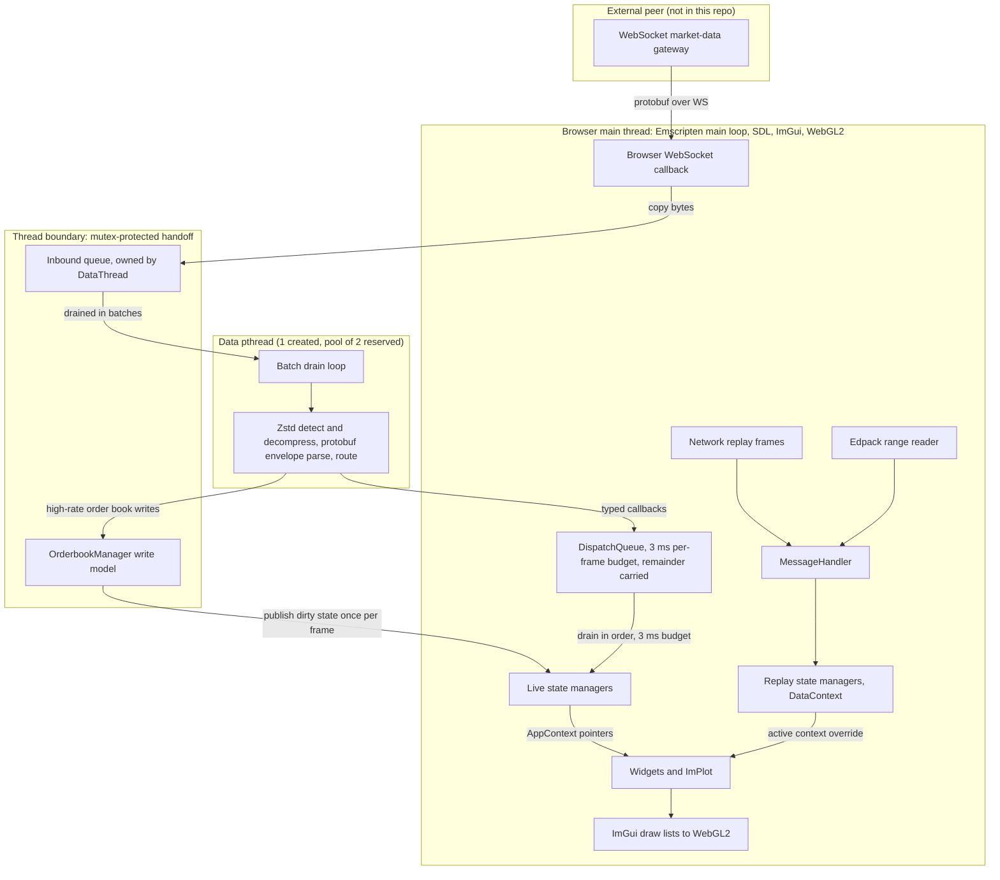

# EdgeDepth Terminal architecture

This document describes the terminal that is checked into this repository: a C++20 application compiled to WebAssembly and rendered in a browser with Dear ImGui, ImPlot, SDL3, and WebGL2. It is intended to help contributors find the right ownership boundary before changing a feed, manager, widget, renderer, replay path, or browser integration.

## Scope and non-goals

The repository contains the browser terminal, its public protobuf contract, replay-pack reader, embedded education runtimes, build configuration, and local serving tools. It does not implement a market-data gateway, exchange adapter, storage service, or trading venue. Those systems are outside this architecture. The terminal treats a configurable WebSocket market-data gateway as an external peer and only assumes the public messages and control flow visible in this repository.

This guide describes verified current behavior. It is not a roadmap, deployment design, or class-by-class catalog. When a summary here and the implementation differ, the linked source is authoritative.

## System at a glance

Live and replay data use the same protobuf envelope, routing code, manager interfaces, and widgets. They do not use the same manager instances. Replay creates an isolated data context and makes it active by changing the pointers exposed through `AppContext`.

## Build-time architecture

[`CMakeLists.txt`](CMakeLists.txt) is the build graph. `emcmake` supplies Emscripten's CMake toolchain, CMake configures the target, and a generator such as Ninja executes the graph. Ninja is the documented cross-platform generator and is exercised by Windows CI; the architecture does not depend on a native terminal executable.

There are two different protobuf tools in the build:

- A host `protoc` executable runs during the build. It must be a 21.x release compatible with protobuf v21.12 and generates `messages.pb.h` and `messages.pb.cc` into the build directory from [`protos/messages.proto`](protos/messages.proto).
- The generated C++ and the fetched protobuf lite runtime are compiled by Emscripten into the WebAssembly target. `protoc` itself is never compiled into or run by the browser.

CMake pins and fetches Dear ImGui, ImPlot, zstd, protobuf, and nlohmann/json. SDL3 is supplied by the Emscripten port selected by the link flags. The zstd target contains decompression support because the client consumes compressed data but does not produce it. The build also compiles all terminal, replay, rendering, widget, and education sources into one WebAssembly application.

The link step uses [`src/shell.html`](src/shell.html) as the browser shell and preloads [`fonts/`](fonts/) at `/fonts`. The application artifacts are `index.html`, `index.js`, `index.wasm`, and `index.data`; the font bundle is why `index.data` is required. [`src/coi-serviceworker.js`](src/coi-serviceworker.js) is copied beside them as a cross-origin-isolation fallback. The output is a browser bundle, not a native executable.

## Bootstrap, main loop, and browser boundary

[`src/main.cpp`](src/main.cpp) owns process-wide application state and startup. It creates the SDL window and WebGL2 context, constructs live managers, starts the data pthread, connects the WebSocket when the selected mode needs it, creates widgets, initializes ImGui and ImPlot, loads fonts and theme state, and registers `main_loop` with `emscripten_set_main_loop`.

Each loop iteration performs browser and SDL event handling, starts a new ImGui frame, drains decoded work, publishes the active order book read snapshot, updates widgets, builds the docked interface, advances replay or embedded runtimes, submits ImGui draw data to WebGL2, and swaps the SDL window. The browser schedules the Emscripten loop. No separate native event loop is produced for the shipped target.

The JavaScript boundary is deliberately narrow:

- [`src/core/websocket.cpp`](src/core/websocket.cpp) wraps the Emscripten WebSocket API.
- `EM_ASM` and exported `EMSCRIPTEN_KEEPALIVE` functions in [`src/main.cpp`](src/main.cpp) and [`src/education/`](src/education/) exchange viewport, transport, and optional embedding state with JavaScript.
- [`src/shell.html`](src/shell.html) owns the canvas and Emscripten `Module` bootstrap.

JavaScript callbacks must not mutate ImGui or rendering state mid-frame. Exported commands that need application state are generally latched or queued and applied from the next main-loop update.

## Threading, ownership, and synchronization

The main thread owns SDL, ImGui, ImPlot, WebGL, widgets, and browser callbacks. The data pthread does not own the WebSocket. A live binary WebSocket callback runs on the browser side of the main runtime and copies the bytes into the inbound queue owned by [`DataThread`](src/core/data_thread.h).

The link reserves an Emscripten pthread pool of two, while the application explicitly creates one `DataThread`. Other application work remains on the browser main thread unless a future source change introduces another pthread.

[`src/core/data_thread.cpp`](src/core/data_thread.cpp) drains that mutex-protected queue in batches. It performs outer zstd detection and decompression, parses the protobuf envelope, and invokes [`MessageHandler`](src/core/message_handler.cpp). Two synchronization paths then keep rendering safe:

- Order-book updates are the high-rate exception. The worker writes to a mutex-protected write model in [`OrderbookManager`](src/core/orderbook_manager.h). Once per frame, the main thread publishes dirty state to a stable read model that DOM and chart code consume.
- Most other decoded work becomes a typed callback in `DispatchQueue`. The main thread drains callbacks in order with a 3 ms per-frame budget, carrying any remainder into later frames. This keeps widget callbacks, manager mutation, and GPU-facing work on the render thread without allowing an ingest burst to consume an entire frame.

Root lifetime belongs to the application state in [`src/main.cpp`](src/main.cpp). [`AppContext`](src/core/app_context.h) is a non-owning dependency bundle passed to widgets. [`MessageContext`](src/core/message_context.h) is the smaller bundle used by the message router. [`DataContext`](src/core/data_context.h) owns the parallel manager set created for replay. These structs make ownership visible without giving widgets ownership of shared managers.

## Live data flow

[`StreamManager`](src/stream_handler.h) keys subscriptions by pair, stream, and timeframe. Widgets and managers register typed callbacks. For its reference-counted streams, the first subscriber sends a JSON subscription request, and removing the final subscriber sends the corresponding unsubscribe. A few global or shared streams have explicit subscription rules. Historical requests use the same control channel.

Incoming text frames carry connection or replay control state and are handled by the main-thread WebSocket callback. A normal live binary frame follows this path:

1. The callback copies its bytes to `DataThread`.
2. [`MessageParser`](src/core/message_parser.cpp) recognizes the zstd frame magic when present, decompresses with a thread-local context, and parses a `pb::WSPayload`.
3. [`MessageHandler`](src/core/message_handler.cpp) switches on the envelope's numeric `Stream`, parses the appropriate inner protobuf, and sends the result to the order-book write model or the main-thread dispatch queue. Selected large inner payloads, such as heatmap snapshots, can also be zstd-compressed and are decompressed in their stream handler.
4. Typed dispatch calls enter [`StreamManager`](src/stream_handler.cpp) or a dedicated manager. Registered consumers update candles, trades, statistics, heatmaps, liquidation state, profiles, indicators, and other shared models.
5. Widgets read the active managers during their normal update and render pass.

This split is important: protobuf decoding can run concurrently, but ordinary widget callbacks and all rendering remain main-thread operations.

## State managers and rendering

Managers turn transport messages into stable models that multiple widgets can read. [`CandleManager`](src/core/candle_manager.h) maintains the active candle series, the building candle, recent trades, and lazily rebuilt plotting arrays. [`HeatmapManager`](src/core/heatmap_manager.h) and [`LiquidationHeatmapManager`](src/core/liquidation_heatmap_manager.h) own time-oriented depth and liquidation models. Order book, footprint, volume profile, TPO, indicator series, and analytics managers follow the same broad rule: ingest once, retain normalized state, and let views consume it. Public market structures and stream identifiers live in [`src/types/types.h`](src/types/types.h).

Widgets derive from [`Widget`](src/ui/widget.h) and use the shared `AppContext`. The chart in [`src/ui/chart_widget.cpp`](src/ui/chart_widget.cpp) is an ImPlot composition rather than a standalone renderer. It layers order-book history, liquidation fields and levels, profiles, candles or alternative price geometry, observed events, footprint data, indicators, and drawings in a defined plot order. Indicator panes use the framework under [`src/ui/indicators/`](src/ui/indicators/). DOM and order-book widgets read the published order-book model rather than the worker's write model.

The expensive dense paths avoid one ImGui primitive per data cell. [`ShaderHeatmapRenderer`](src/rendering/shader_heatmap_renderer.h) stores heatmap columns in WebGL textures and injects a custom draw callback into the plot. [`LiqFieldTextureRenderer`](src/rendering/liq_field_texture_renderer.h) provides an R8 texture and lookup-table path for the dense liquidation field, with a rectangle fallback. ImGui still owns layout, clipping, and command ordering around those GPU paths.

[`Theme`](src/rendering/theme.h) maps the checked-in [`design/`](design/README.md) tokens into ImGui and ImPlot styles and fonts. [`LayoutManager`](src/rendering/layout.h) owns the dockspace and default panel arrangement, while [`AppShell`](src/rendering/app_shell.h) owns persistent chrome and status presentation. A new widget should use these responsibilities instead of hardcoding colors, fonts, or dock positions.

## Replay architecture

[`ReplayManager`](src/replayer/replay_manager.h) owns the replay lifecycle, clock, buffering gates, seeking, speed, and context activation. On entry it creates a replay [`DataContext`](src/core/data_context.h) with fresh stream, order-book, candle, heatmap, liquidation, profile, footprint, indicator, and analytics managers. Normal live subscriptions are paused and live state is retained. The application's `AppContext` pointers are changed to the replay managers, so existing widgets render replay state without source branches in every view. Stopping replay restores the live pointers. A normal standalone replay also resumes live subscriptions; embedded lesson and event mounts deliberately remain unsubscribed because navigation replaces the mount.

There are two replay inputs:

- Network replay control and status use text WebSocket messages. Replay binary frames contain the same `WSPayload` envelope and are routed through `MessageHandler` with the replay message context. They are handled on the main thread rather than being put on the live data queue.
- [`PackReplayEngine`](src/replayer/pack_replay_engine.h) reads static `.edpack` files. It range-fetches the header and time-indexed compressed blocks, unwraps `PackFrame` records into `WSPayload` values, and routes them through the same replay message context. Pack-specific code supplies lifecycle events, local clocking, seeks, and any historical seeds stored in the pack.

The convergence is downstream, not total. Network replay and pack replay have different acquisition and control adapters, while message dispatch, replay managers, active-context selection, widgets, and renderers are shared. Contributors should not describe the paths as byte-for-byte or pixel-identical.

Pack hosting is part of the runtime contract. [`replay-library/README.md`](replay-library/README.md) documents manifest overrides and CORS requirements. A cross-origin pack host must permit `GET` with `Range` and expose `Content-Range`, `Content-Length`, and `ETag`. [`serve_threaded.py`](serve_threaded.py) supplies the required browser headers and single-range responses for local testing. If a server ignores `Range`, the pack reader can fall back to a whole-file response, but that is unsuitable for large packs.

## Protobuf and wire-contract boundary

[`protos/messages.proto`](protos/messages.proto) is the checked-in client wire contract. `WSPayload` carries pair, stream, timeframe, opaque inner message bytes, and event time. Stream enum values and protobuf field numbers are compatibility identifiers, not convenient local ordinals. Existing values must not be renumbered or reused. Pack headers and frames in the same schema have the same compatibility requirement.

Adding a wire feature normally requires all of the following: update the schema, regenerate with the compatible host `protoc`, keep the matching C++ stream identifier in [`src/types/types.h`](src/types/types.h), add parsing and routing in [`MessageHandler`](src/core/message_handler.cpp), and add subscription or request handling in [`StreamManager`](src/stream_handler.cpp). A schema-only change does not make a stream usable.

## Education, studio, and event boundaries

The public source includes optional embedded runtimes. [`EducationBoot`](src/core/education_boot.h) selects standalone, lesson, studio, event, or pack behavior from browser-provided startup state. [`LessonRuntime`](src/education/lesson_runtime.h) applies lesson gates and chart-space overlays to a replay. [`StudioRuntime`](src/education/studio_runtime.h) adapts authoring transport and chart-region capture commands. [`EventRuntime`](src/education/event_runtime.h) mirrors replay transport for an embedded event view.

These are browser control and presentation adapters, not alternate market-data architectures. Commands cross exported functions, are applied during a main-thread update with the current `AppContext`, and state snapshots return through browser `CustomEvent` dispatch in [`transport_emit.h`](src/education/transport_emit.h). The underlying replay manager, data contexts, widgets, and renderer remain the terminal runtime described above.

## Browser deployment requirements

The target is linked with pthread support, so production and local pages must be cross-origin isolated. The terminal requires both `Cross-Origin-Opener-Policy: same-origin` and `Cross-Origin-Embedder-Policy: require-corp` before the browser will expose `SharedArrayBuffer`. A plain static server without those headers will not boot the threaded build.

Serve `.wasm` as `application/wasm`, keep all four application artifacts from the same build, and avoid immutable caching for stable names such as `index.wasm` unless a versioned outer layer changes the URLs. [`serve_threaded.py`](serve_threaded.py) is the local reference. The container path uses [`Dockerfile`](Dockerfile) and [`docker/nginx.conf`](docker/nginx.conf), which set the isolation headers, WebAssembly MIME behavior, and revalidation policy.

The configured WebSocket URL is resolved by the user's browser, not by the terminal container. It therefore must be browser-reachable. Cross-origin replay manifests, packs, fonts, or other resources must also satisfy the page's COEP and normal CORS rules.

## Testing and CI boundaries

[`tests/native/`](tests/native/) is a small CMake and CTest suite for pure C++ code that does not require Emscripten. It currently pins the research URL and timestamp behavior; it is not a substitute for browser, rendering, replay, or wire-contract tests. The public [build workflow](.github/workflows/build.yml) runs that suite and compiles the WebAssembly target on Ubuntu and Windows. CI pins Emscripten 4.0.15 and host `protoc` 21.12, and verifies all four application artifacts.

The current workflow proves compilation and the native unit boundary. It does not launch a browser, connect a gateway, validate a replay pack end to end, or compare rendered frames. Changes in those areas need focused manual verification or a new automated boundary rather than relying on the compile job alone.

## Safe extension points and invariants

- New widgets should receive `AppContext`, subscribe through `StreamManager`, unsubscribe on destruction, read manager state, and keep all ImGui and WebGL work on the main thread.
- New decoded data must have an explicit ownership decision. Use main-thread dispatch for normal manager or widget mutation. Only extend the worker-write path with synchronization and a stable render-side snapshot.
- New replay-visible state needs a replay-owned manager or a deliberate reason to remain application-global. Otherwise live and replay data will leak into each other when `AppContext` changes.
- New dense rendering should preserve ImPlot clipping and draw ordering, cache CPU transformations, and update GPU textures incrementally where possible. Theme and layout changes belong in their existing subsystems.
- New pack data must preserve range-read behavior, immutable schema identifiers, seek correctness, and CORS compatibility.

The most common architectural mistakes are treating the WebSocket as worker-owned, calling widget callbacks from the data pthread, reading the order-book write model while it is being changed, touching GL outside the render thread, using the live manager directly instead of the active `AppContext`, renumbering protobuf fields or stream values, omitting `index.data`, or serving the threaded bundle without COOP and COEP. Each bypasses a boundary that the current implementation relies on for correctness.
